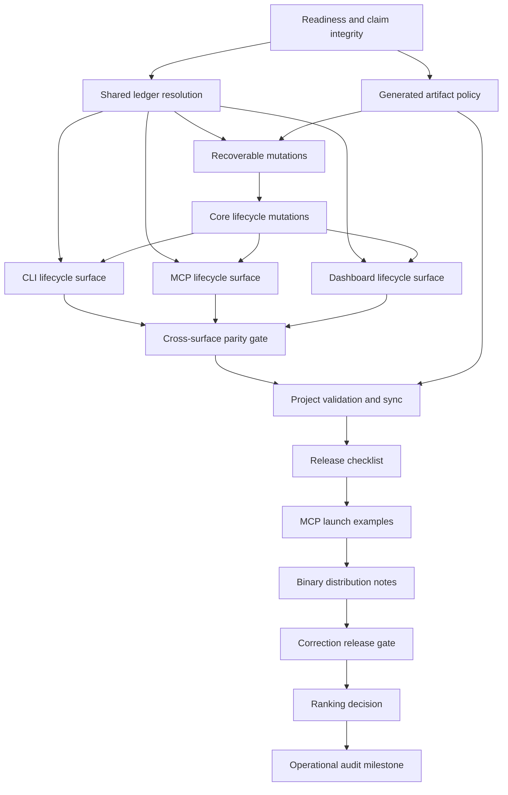

# Operational Audit Corrections Plan

This document describes the implementation plan for correcting the behavior and workflow gaps found while testing Waystation v0.0.3 and migrating DuckBrain to its ledger.

Waystation task records are the source of truth for execution status, dependencies, claims, acceptance criteria, commits, and completion. This document explains the intended architecture and sequence; it is not a second task tracker. Start from [`task-operational-audit-corrections`](../.waystation/tasks/task-operational-audit-corrections.json) and use `waystation task next` for current work.

## Executive Summary

The audit found that Waystation's storage foundation is strong: canonical JSON is transparent and recoverable, validation catches many structural failures, generated context is deterministic, and claims/messages/events create useful history. The main weakness is that several surfaces interpret workflow state differently.

The correction program establishes four system-wide contracts:

1. **One readiness model.** Stored task status expresses workflow intent; readiness is derived from status and dependencies. Only a declared `ready` task with satisfied dependencies can be claimed.
2. **One coordination root.** Every operation resolves an existing ledger explicitly, and separate Git worktrees can opt into one shared ledger and one filesystem lock without confusing ledger location with caller Git context.
3. **One recoverable mutation path.** Normal task and issue lifecycle changes use core functions that lock, record durable intent, append events, and recover coherently after interruption. CLI, MCP, and dashboard remain thin wrappers.
4. **One health model.** Validation and generated outputs use the same readiness semantics, project-aware checks are available when requested, and synchronization is ordered and repeatable.

The program deliberately does not add a daemon, hosted service, automatic main-worktree discovery, automatic Git operations, or a new `deferred` status. It also does not silently close unrelated findings from the older codebase audit: only the stable `OA-*` findings below belong to this milestone. Older findings remain governed by [`docs/audit-2026-07-08.md`](audit-2026-07-08.md) unless explicitly referenced here.

## Audit Findings and Planned Outcomes

| ID | Evidence source | Finding and risk | Planned outcome | Canonical task |
|---|---|---|---|---|
| `OA-01` | DuckBrain migration | `todo` and `ready` are both actionable, so backlog work can be selected | Only declared `ready` tasks with satisfied dependencies are actionable | [`task-audit-correct-readiness-claims`](../.waystation/tasks/task-audit-correct-readiness-claims.json) |
| `OA-02` | Operational testing | Direct claim bypasses dependency eligibility | Re-evaluate readiness while holding the ledger lock | [`task-audit-correct-readiness-claims`](../.waystation/tasks/task-audit-correct-readiness-claims.json) |
| `OA-03` | Operational testing | Briefs, reports, validation, and index queries disagree about blockers and `wont_do` | Use one readiness/dependency contract everywhere | [`task-audit-correct-readiness-claims`](../.waystation/tasks/task-audit-correct-readiness-claims.json) |
| `OA-04` | Multi-worktree testing | Checkout-local claims/messages allow separate worktrees to coordinate against different ledgers | Add explicit shared-root selection and shared locking | [`task-audit-shared-ledger-resolution`](../.waystation/tasks/task-audit-shared-ledger-resolution.json) |
| `OA-05` | DuckBrain migration | A missing ledger looks like an empty project | Return `ledger_not_found` for non-`init` operations | [`task-audit-shared-ledger-resolution`](../.waystation/tasks/task-audit-shared-ledger-resolution.json) |
| `OA-06` | Prior audit H4 | Per-file atomic writes can leave a multi-record mutation partially applied after a crash | Add durable intent, idempotent recovery, and crash-injection tests | [`task-audit-mutation-recovery`](../.waystation/tasks/task-audit-mutation-recovery.json) |
| `OA-07` | DuckBrain migration | Routine lifecycle edits require hand-written JSON, risking inconsistent timestamps, events, claims, and transitions | Add safe core task/issue mutations | [`task-audit-lifecycle-mutations`](../.waystation/tasks/task-audit-lifecycle-mutations.json) |
| `OA-08` | DuckBrain migration | Issue parsing strips evidence and resolution context | Expand the typed schema and preserve unknown fields | [`task-audit-lifecycle-mutations`](../.waystation/tasks/task-audit-lifecycle-mutations.json) |
| `OA-09` | Operational testing | Lifecycle operations are missing or inconsistent across public surfaces | Implement separate [CLI](../.waystation/tasks/task-audit-lifecycle-cli-surface.json), [MCP](../.waystation/tasks/task-audit-lifecycle-mcp-surface.json), and [dashboard](../.waystation/tasks/task-audit-lifecycle-dashboard-surface.json) slices, then enforce [parity](../.waystation/tasks/task-audit-lifecycle-surfaces.json) |
| `OA-10` | DuckBrain migration | Structural validation accepts semantically misleading ledgers | Add readiness warnings and opt-in project checks | [`task-audit-project-validation-sync`](../.waystation/tasks/task-audit-project-validation-sync.json) |
| `OA-11` | Operational testing | Regeneration is manual, can drift, and can certify mixed snapshots | Decide artifact policy first, then add deterministic snapshot-aware sync and freshness checks | [policy](../.waystation/tasks/task-audit-generated-artifact-policy.json), [sync](../.waystation/tasks/task-audit-project-validation-sync.json) |
| `OA-12` | Operational testing | Claim counts mix active and historical records | Report `claims_active` and `claims_total` separately | [`task-audit-project-validation-sync`](../.waystation/tasks/task-audit-project-validation-sync.json) |
| `OA-13` | Product feedback | Equal-priority ordering lacks an explicit product decision | Record a ranking ADR without expanding the correctness release | [`task-audit-ranking-policy`](../.waystation/tasks/task-audit-ranking-policy.json) |

This table is the durable coverage matrix for the milestone. Release and milestone closure must attach a verification result or decision record to every `OA-*` row; vague references to external feedback are insufficient.

## Governing Invariants

The implementation must preserve these project rules:

- Canonical state remains JSON under `.waystation/`.
- SQLite remains a disposable, rebuildable index.
- Generated Markdown remains one-way output and is never parsed as state.
- Every canonical mutation runs through one recoverable core protocol under `withLedgerLock`; per-file `writeJsonAtomic` calls and `appendEventUnlocked` remain building blocks, not a multi-file transaction guarantee.
- CLI, MCP, and dashboard never duplicate lifecycle, readiness, validation, or path-resolution rules.
- All public operations return `CommandResult<T>` with cataloged diagnostics; raw stacks never reach callers.
- Zod schemas remain authoritative for persisted records and mutation input.
- Existing ledgers remain readable without a mandatory bulk rewrite.
- The correction program is local-first and works without a daemon or external service.

## Target Task Model

### Declared status and derived readiness

`TaskRecord.status` remains canonical. The system computes a readiness object from the current task graph instead of storing an `effective_status` that could become stale.

The readiness result should contain:

- `state`: `actionable`, `waiting`, or `not_eligible`;
- `reason`: a stable machine-readable reason code;
- `blockers`: dependency ids preventing action;
- optional display text generated by the surface, not stored in the task.

| Declared status | Dependencies | Derived readiness | Claimable |
|---|---|---|---|
| `todo` | Any | `not_eligible` | No |
| `ready` | All `done` or `wont_do` | `actionable` | Yes |
| `ready` | Any other dependency state or missing dependency | `waiting` | No |
| `blocked` | Any | `not_eligible` | No |
| `in_progress` | Any | `not_eligible` | Already active |
| `review` | Any | `not_eligible` | No |
| `done` | Any | `not_eligible` | No |
| `wont_do` | Any | `not_eligible` | No |

A missing dependency remains a validation error and also appears as a readiness blocker. A `wont_do` dependency is satisfied everywhere: ready queues, direct claims, briefs, generated reports, validation, and index-backed queries.

### Claim atomicity

Selection is advisory; claiming is authoritative. `claimTask` must acquire the ledger lock, reload the task and dependency graph, verify declared status, compute current readiness, and check active claims before writing anything.

Rejected claims must leave tasks, claims, and events unchanged:

- `todo`, `blocked`, `review`, and terminal states return `invalid_transition`;
- dependency-blocked `ready` tasks return `task_not_ready` with blocker ids;
- an existing active claim returns `task_already_claimed`;
- unsafe or missing task ids retain their existing coded diagnostics.

### Lifecycle transition model

Generic metadata updates must not change status or claim state. Status changes use explicit operations and append dedicated events.

| From | Allowed target or operation |
|---|---|
| `todo` | `ready`, `wont_do` |
| `ready` | `todo`, `blocked`, `wont_do`, or `in_progress` through claim |
| `blocked` | `todo`, `ready`, `wont_do` |
| `in_progress` | `ready` through release, `review` through submit-for-review, or `done` through finish |
| `review` | `ready` through request-changes, or `done` through finish |
| `done` | `todo` or `ready` through explicit reopen |
| `wont_do` | `todo` or `ready` through explicit reopen |

Entering `in_progress` directly through `task set-status` is forbidden; it requires a claim. An active claim may exist only while the task is `in_progress`. Release closes the claim and returns the task to `ready`; submit-for-review closes the claim and moves to `review`; request-changes returns review work to `ready`, where it must be claimed again. Finishing from `in_progress` closes the active claim, while finishing from `review` requires no fabricated claim. Reopening a terminal task requires the caller to choose `todo` or `ready`, clears `closed_at`, updates `updated_at`, and does not manufacture readiness.

## Ledger Resolution and Worktree Coordination

### Resolution order

Every non-`init` operation must resolve a root that already contains `.waystation`:

1. explicit global `--root <project-root>` or equivalent server option;
2. `WAYSTATION_ROOT`;
3. upward discovery from the caller's current directory;
4. otherwise `ledger_not_found`.

`init` is the sole exception because it must target a directory without an existing ledger.

### Ledger root versus caller worktree

Shared coordination requires two distinct contexts:

- **Ledger root:** owns canonical records, events, index, reports, and the filesystem lock.
- **Caller worktree:** supplies Git branch, worktree path, status, and project-relative path context.

An agent in worktree B may explicitly target a ledger in coordination checkout A. The claim is stored and locked in A but records B as the worktree and B's branch as the branch. Two agents targeting the same root contend on the same lock, so only one same-task claim succeeds.

Automatic main-worktree discovery is out of scope. It could silently write into and dirty an unrelated checkout. The checkout-local model remains the default described by ADR-0003; shared-ledger operation is explicit.

## Recoverable Multi-file Mutations

Task: [`task-audit-mutation-recovery`](../.waystation/tasks/task-audit-mutation-recovery.json)

The existing lock prevents concurrent writers, and atomic rename protects an individual file, but neither makes a claim/task/event update all-or-nothing. Before lifecycle mutation surface area grows, core must adopt a durable mutation-intent protocol:

1. acquire the selected ledger's lock;
2. recover or reject any incomplete prior intent;
3. validate and record durable intent for the new operation;
4. apply record and event writes in a documented order;
5. fsync the required files/directories;
6. clear intent only after the operation is recoverably complete.

The protocol may use a replay journal or staged manifest, but the ADR must specify every crash boundary and whether recovery completes or rolls back it. Recovery is idempotent and occurs under the same lock before any later mutation. Crash-injection tests—not ordinary concurrent promises—are the acceptance proof.

## Safe Task and Issue Mutations

### Core task operations

Core should provide:

- `createTask` with default status `todo` and consistent timestamps;
- `updateTask` for whitelisted metadata fields;
- explicit lifecycle transition operations;
- `reopenTask` for terminal records;
- existing claim, release, and finish operations tightened to the lifecycle model.

Generic patches may update title, priority, scope, path hints, prompts, dependencies, description, acceptance criteria, notes, and an optional future rank. They may not update id, status, creation time, close time, claims, or commits outside their dedicated workflows.

Every operation validates before recording intent or writing records. A rejected mutation writes nothing; an interrupted accepted mutation is completed or rolled back by the shared recovery protocol.

### Rich issue schema

`IssueRecord` should model the fields used during diagnosis and resolution:

- identity, title, status, severity, type, priority, task, and scope;
- description and evidence;
- expected and actual behavior;
- acceptance criteria;
- resolution and notes;
- source metadata;
- created, updated, and closed timestamps.

New fields remain optional for backward compatibility. Additional unknown fields are preserved on read and write so a metadata update cannot erase imported context, while modeled fields remain the supported typed contract.

Core should add issue update and close operations alongside existing creation. Closing an issue records resolution, status, `updated_at`, `closed_at`, and an event atomically.

### Surface commands

Thin surfaces are implemented as independent, bounded tasks:

- [`task-audit-lifecycle-cli-surface`](../.waystation/tasks/task-audit-lifecycle-cli-surface.json);
- [`task-audit-lifecycle-mcp-surface`](../.waystation/tasks/task-audit-lifecycle-mcp-surface.json);
- [`task-audit-lifecycle-dashboard-surface`](../.waystation/tasks/task-audit-lifecycle-dashboard-surface.json);
- [`task-audit-lifecycle-surfaces`](../.waystation/tasks/task-audit-lifecycle-surfaces.json) as the parity gate.

Together they expose equivalent behavior:

- `task create`, `task update`, `task set-status`, `task reopen`;
- `issue list`, `issue show`, `issue create`, `issue update`, `issue close`;
- corresponding MCP tools;
- corresponding dashboard API routes and UI controls.

Parity tests must prove that invoking the same operation through CLI, MCP, or dashboard produces equivalent canonical JSON, events, timestamps, and diagnostic codes.

## Validation, Synchronization, and Generated Output

### Default validation

Default `validate` retains structural checks and adds semantic warnings that require no project filesystem context. In particular, a task declared `ready` with unmet dependencies should produce a warning naming the task and blockers. `done` and `wont_do` dependencies do not trigger the warning.

### Project validation

`validate --project` adds checks that depend on the caller project root:

- literal relative path hints must remain inside the project root;
- missing literal paths produce warnings, because a task may intentionally describe a file that will be created;
- glob semantics are deferred until explicitly specified;
- generated STATUS, active-work, blocked, and requested task views are compared with deterministic current output without rewriting files.

Validation remains read-only.

### Synchronization

`waystation sync [--views]` should execute this order:

1. validate canonical records;
2. stop immediately if canonical errors exist;
3. rebuild the disposable index;
4. regenerate reports and optional task views;
5. run project validation and return one result envelope.

Sync must either operate from a consistent canonical snapshot or detect that canonical state changed during the run and refuse to certify mixed derived output. Two sync runs without canonical changes must produce byte-identical output. Every generated Markdown file ends with exactly one LF. Reindex results distinguish `claims_total` from `claims_active`.

## Policy Decisions

### Generated artifact policy

Task: [`task-audit-generated-artifact-policy`](../.waystation/tasks/task-audit-generated-artifact-policy.json)

The generated-artifact decision precedes sync implementation because it determines which outputs are emitted, tracked, and freshness-validated. It must distinguish canonical JSON, the disposable SQLite index, and generated Markdown, and align ignore rules, `report`/`sync`, documentation, and migration expectations before [`task-audit-project-validation-sync`](../.waystation/tasks/task-audit-project-validation-sync.json) implements the result.

### Equal-priority ranking

Task: [`task-audit-ranking-policy`](../.waystation/tasks/task-audit-ranking-policy.json)

Ranking is a lower-priority product decision, not a correctness-release prerequisite. It runs after the correction release and before milestone closure. The task must compare:

- current priority then id;
- priority then creation time then id;
- optional explicit nonnegative `rank`, followed by creation time and id.

If rank is accepted, the decision creates a separately phased implementation task covering schema, migration, mutations, CLI, MCP, dashboard, and deterministic tests. The current correction release does not absorb that optional feature.

No `deferred` status is planned. After the readiness correction, `todo` is the non-actionable backlog state. A separate status should be reconsidered only if real usage proves `todo` insufficient.

## Implementation Sequence

The canonical dependency graph is:



### Phase 1 — Readiness and claim integrity

Task: [`task-audit-correct-readiness-claims`](../.waystation/tasks/task-audit-correct-readiness-claims.json)

Implement the pure evaluator, claim-time enforcement, consistent dependency satisfaction, response/readiness types, and the complete status/dependency test matrix. This is the first task because every later lifecycle, validation, and UI operation depends on its semantics.

### Phase 2A — Ledger resolution and shared worktrees

Task: [`task-audit-shared-ledger-resolution`](../.waystation/tasks/task-audit-shared-ledger-resolution.json)

Implement missing-ledger errors, root precedence, shared-root configuration, caller Git context separation, and concurrent worktree claim tests. Update ADR-0003 only after behavior is verified.

### Phase 2B — Generated-output policy

Task: [`task-audit-generated-artifact-policy`](../.waystation/tasks/task-audit-generated-artifact-policy.json)

After Phase 1, decide generated-output policy before sync design. It may proceed while ledger resolution is implemented because it does not edit mutation or resolver code. Recovery waits for both tasks, preventing overlapping core-scope work.

### Phase 3 — Recoverable multi-file mutations

Task: [`task-audit-mutation-recovery`](../.waystation/tasks/task-audit-mutation-recovery.json)

Close prior audit H4 with durable intent, idempotent recovery, coded validation, and crash-injection tests. It follows ledger resolution and generated-output policy so recovery consistently targets the selected ledger and core-scope work does not overlap.

### Phase 4 — Core lifecycle mutations

Task: [`task-audit-lifecycle-mutations`](../.waystation/tasks/task-audit-lifecycle-mutations.json)

Implement task and issue mutation schemas/functions, claim-coherent transition matrices, issue schema expansion, non-destructive round trips, events, and recovery integration.

### Phase 5A — CLI, MCP, and dashboard surfaces

Tasks: [CLI](../.waystation/tasks/task-audit-lifecycle-cli-surface.json), [MCP](../.waystation/tasks/task-audit-lifecycle-mcp-surface.json), and [dashboard](../.waystation/tasks/task-audit-lifecycle-dashboard-surface.json)

Expose the finalized core functions through three separately owned thin surfaces. Precise path hints and tests let these tasks proceed in parallel without one oversized cross-layer task.

### Phase 5B — Project validation and sync

Task: [`task-audit-project-validation-sync`](../.waystation/tasks/task-audit-project-validation-sync.json)

Add semantic warnings, project checks, stale-output detection, exact final newlines, active/total claim counts, and snapshot-aware deterministic sync. It follows generated-output policy and the completed cross-surface parity gate because it owns the `sync` CLI command and final health contract.

### Phase 6 — Cross-surface parity gate

Task: [`task-audit-lifecycle-surfaces`](../.waystation/tasks/task-audit-lifecycle-surfaces.json)

After all three surface slices land, run equivalence tests and fix any wrapper drift without reimplementing core semantics.

### Phase 7 — Phase 10 packaging documentation

Tasks, serialized to avoid overlapping documentation edits:

1. [`task-phase10-release-checklist`](../.waystation/tasks/task-phase10-release-checklist.json);
2. [`task-phase10-mcp-launch-examples`](../.waystation/tasks/task-phase10-mcp-launch-examples.json);
3. [`task-phase10-binary-distribution-notes`](../.waystation/tasks/task-phase10-binary-distribution-notes.json).

These previously independent ready tasks now follow final lifecycle and sync behavior, so they cannot document obsolete ledger discovery or release commands.

### Phase 8 — Migration and release gate

Task: [`task-audit-corrections-release`](../.waystation/tasks/task-audit-corrections-release.json)

Audit dependency-satisfied `todo` tasks for intentional promotion, reconcile documentation and help text, attach evidence to every release-gating `OA-*` finding, regenerate derived state, run the full verification matrix, update Graphify, bump every version location, rebuild the binary, and complete the dogfooding workflow.

### Phase 9 — Non-gating ranking decision

Task: [`task-audit-ranking-policy`](../.waystation/tasks/task-audit-ranking-policy.json)

After the correctness release, record the equal-priority ordering decision. If explicit rank is justified, create a separately phased implementation task; do not reopen or expand the completed correction release.

### Milestone closure

Task: [`task-operational-audit-corrections`](../.waystation/tasks/task-operational-audit-corrections.json)

Close the milestone after the release task, the post-release ranking decision, and every `OA-*` finding is fixed or covered by a recorded decision.

## Compatibility and Migration

### Behavioral changes

- Dependency-free `todo` tasks stop appearing in ready/next and become unclaimable.
- A direct claim of a dependency-blocked `ready` task starts failing.
- Commands outside a ledger return `ledger_not_found` instead of successful empty output.
- Reindex count output changes from an ambiguous claim count to explicit total and active fields.
- Lifecycle transitions become stricter and must use dedicated commands.

### Data compatibility

- Existing task JSON remains valid; readiness is not persisted.
- Existing issue JSON remains valid because new modeled fields are optional.
- Unknown issue fields are preserved rather than discarded.
- Optional rank, if accepted, has a deterministic fallback for records without it.
- Explicit shared-root selection changes location, not record format.

### Migration procedure

The correction program itself is bootstrapped safely: every dependency-gated implementation and milestone task is already declared `ready`. Under the target model, unmet dependencies make those tasks `waiting`; completing a dependency naturally advances the graph without direct status edits.

Before releasing the new readiness behavior:

1. list all `todo` tasks whose dependencies are currently satisfied;
2. promote only tasks that are genuinely ready for implementation;
3. leave backlog and strategically parked work as `todo`;
4. identify any automation that expects the old `claims` count or empty-ledger behavior;
5. regenerate reports/views with the new binary;
6. run structural and project validation;
7. inspect the resulting Git diff before committing.

No automatic mass promotion is allowed. Rollback uses the previous binary; new optional issue fields remain readable as unknown fields by older code.

## Verification Strategy

### Unit tests

- table-driven readiness for every task status and dependency state;
- transition-matrix acceptance and rejection;
- patch-schema whitelists and immutable fields;
- root-resolution precedence and missing-ledger diagnostics;
- issue passthrough/round-trip behavior;
- exact final-newline output;
- deterministic priority/rank ordering if rank is accepted.

### Core integration tests

- claim evaluation and writes occur under one lock;
- rejected mutations produce no records or events;
- crash injection after every durable boundary recovers or rolls back multi-record operations coherently;
- two concurrent agents targeting one ledger cannot both claim the same task;
- a secondary worktree records its own Git context in a shared ledger;
- sync is idempotent and stops before generation on canonical errors;
- project validation detects stale output without modifying it.

### Surface parity tests

- CLI, MCP, and dashboard produce equivalent task and issue mutations;
- all surfaces expose declared status, derived readiness, blockers, and rich issue context;
- all surfaces return the same diagnostic codes for invalid transitions, unmet dependencies, duplicates, missing ledgers, and claim conflicts.

### Release verification

Run the complete project checklist:

```powershell
$bun = "C:\bun\bin\bun.exe"
& $bun test
& $bun run typecheck
& $bun run check
.\waystation.exe sync --views
.\waystation.exe validate --project
graphify update .
& $bun build --compile src/cli/index.ts --outfile waystation.exe
```

Also smoke-test the compiled CLI, MCP startup, dashboard startup, a fresh ledger, an unrelated directory, and two real Git worktrees sharing one explicit ledger.

## Risks and Mitigations

| Risk | Mitigation |
|---|---|
| Existing `todo` tasks disappear from agent queues | Provide a migration audit and require intentional promotion |
| A crash interrupts a multi-file canonical mutation | Record durable intent, recover under the ledger lock, validate malformed intent, and test every write boundary |
| Shared root dirties its owning checkout | Keep selection explicit, display the resolved root, and recommend a dedicated coordination checkout |
| Ledger root and caller worktree are accidentally conflated | Use distinct internal parameter names/types and integration tests from a secondary worktree |
| Lifecycle command growth causes wrapper drift | Implement core first and require cross-surface parity tests |
| Passthrough issue fields weaken strictness | Strictly validate modeled fields while preserving extras for non-destructive round trips |
| Project validation produces noise for planned files | Treat missing path hints as warnings and show the checked root |
| Sync is interrupted between derived writes | Keep canonical data untouched, write each artifact atomically, and make reruns idempotent |
| Rank or new statuses expand schema without evidence | Keep ranking decision-only and create a separately phased implementation task only if evidence supports it |
| Documentation becomes another source of status truth | Keep progress only in Waystation records and avoid completion checkboxes here |

## Execution Protocol

For each implementation task:

1. run `waystation inbox --agent <name>`;
2. run `waystation task next` and read the selected task thread;
3. claim the task before editing;
4. post a start update and coordination warnings;
5. implement only the task's acceptance criteria;
6. run relevant tests plus the required project checks;
7. post completion details and commit references;
8. finish the task;
9. reindex, regenerate reports/views, validate, and check the next task.

Agents working in parallel must coordinate any overlap in `mutate.ts`, `schema.ts`, `result.ts`, CLI command registration, dashboard routes, or shared test fixtures.

## Program Definition of Done

The program is complete when:

- the dependency graph reaches the release task and milestone naturally through Waystation without hand-editing statuses;
- task selection, claiming, briefs, reports, validation, index queries, CLI, MCP, and dashboard share one readiness contract;
- separate worktrees can explicitly coordinate through one ledger without duplicate claims;
- routine task and issue lifecycle work no longer requires direct JSON edits;
- rich issue context survives every supported read/write path;
- missing ledgers, stale generated state, and readiness inconsistencies are visible and actionable;
- synchronization and generated Markdown are deterministic;
- every `OA-*` finding is linked to a fix or durable decision and verification result;
- source checks, ledger validation, Graphify update, version bump, compiled binary, and smoke tests are complete;
- the Waystation ledger, hand-authored documentation, generated reports, and released behavior agree.
